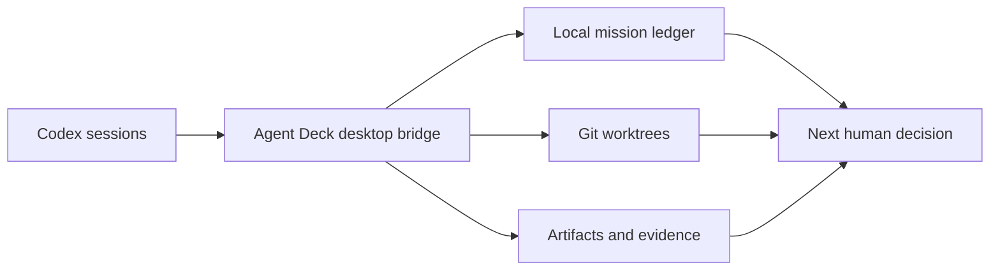

# Agent Deck

Agent Deck 是一个 macOS-first、local-first 的桌面应用，用于同时管理多条真实的
Codex 会话，并在需要时把一条会话组织为带审批、依赖、证据和 review gate 的
Mission 工作流。

它不把 mock 进度、虚构 agent 或合成运行状态伪装为真实执行：运行信息必须来自本地
provider、事件账本、Git 或可见的派生指标。

## 能力边界



- 会话优先：独立会话拥有各自的目标、上下文、仓库/工作树、终端与运行状态。
- Mission：可选的 Main Agent → Worker → review gate 编排，计划在批准前不会被呈现为成功。
- 本地安全：通过 Electron main-process bridge 访问本机资源；研究模式使用应用管理的隔离工作区。
- 证据优先：任务结果、文件变更、验收证据和消息均来自真实持久化记录。

## 界面演示

Mission 画布把 Main Agent、依赖任务、证据、人工验收与集成决策放在同一个可追溯的工作区。
下面是由设计 QA 记录生成的简短演示；它展示界面与已验证交互，不代表一个正在运行的外部任务。


[下载 1080p 演示视频](assets/showcase/agent-deck-walkthrough.mp4)

| 任务依赖与审阅入口 | 集成前的人工决策 |
| --- | --- |
|  |  |

## 开发

```bash
npm install
npm run build
npm run test:mission
```

常用检查：

```bash
npm run test:sites
npm run test:providers
npm run test:attention-policy
npm run test:desktop
```

`npm run desktop:run` 运行桌面程序。浏览器构建仅作为诚实的预览壳，不能伪造桌面运行时数据。

## 仓库结构

```text
src/        React UI、会话与 Mission 交互
desktop/    Electron 主进程、Codex bridge、持久化与编排实现
tests/      单元与 Mission 行为测试
scripts/    构建、冒烟与设计 QA 工具
docs/       架构、能力、发布与 QA 记录
artifacts/  设计 QA 的可审计截图和结构化报告
```

设计原则、架构和测试证据见 [`docs/`](docs/)。安装包与浏览器构建均可由源码生成，故不提交到 Git。
