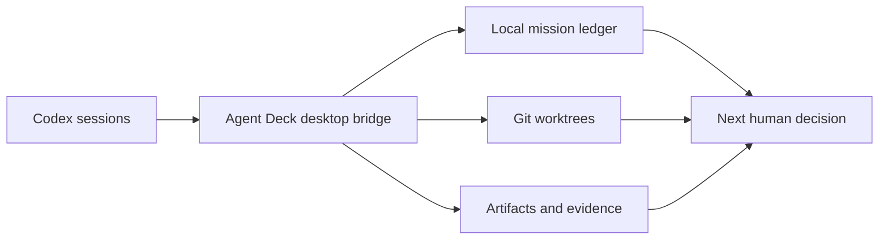
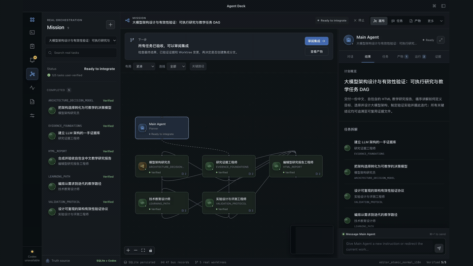
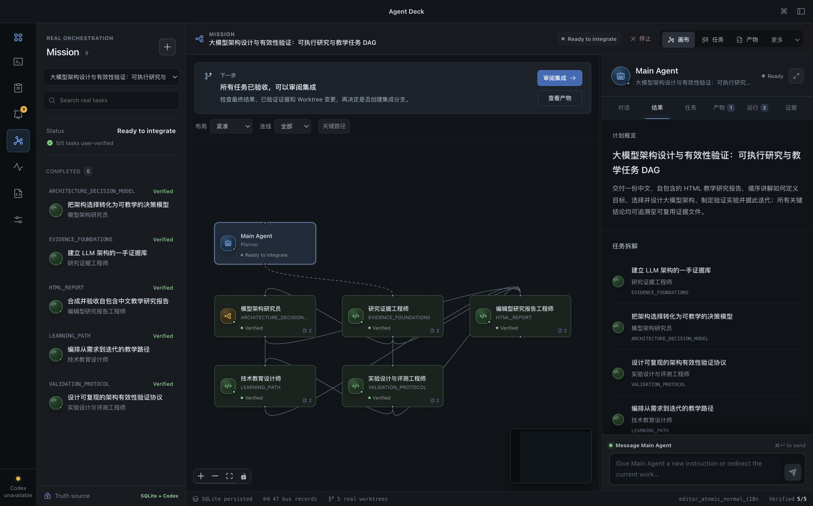
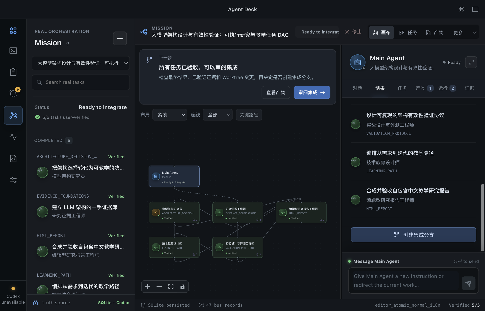

# Agent Deck

Agent Deck 是一个 macOS-first、local-first 的 Personal Agent 工作台：先记下想做的事，
准备好后再拆成带依赖的执行计划，最后验收交付并归入文档与资产库。
它支持外部 Coding Agent 和自有 Harness 两种执行模式，切换只影响新工作。

它不把 mock 进度、虚构 agent 或合成运行状态伪装为真实执行：运行信息必须来自本地
provider、事件账本、Git 或可见的派生指标。

## 能力边界



- 工作优先：任务可以先作为笔记保存，不必立即创建会话或消耗模型 Token。
- 按需对话：DAG 节点默认显示任务和状态，明确点击「进入对话」才加载会话与输入框。
- Mission：可选的 Main Agent → Worker → review gate 编排，计划在批准前不会被呈现为成功。
- 本地安全：通过 Electron main-process bridge 访问本机资源；研究模式使用应用管理的隔离工作区。
- 证据优先：任务结果、文件变更、验收证据和消息均来自真实持久化记录。

## 从任务到交付

1. 在「工作」输入一行想法，回车保存；也可以补充笔记。保存不会启动模型。
2. 填写完成标准、选择工作区与工作类型，点击「开始做 · 拆解计划」。确认计划后才执行；独立任务受并发限制调度，有依赖的任务等待前置验收。
3. 在 DAG 查看关系、拖拽节点；需要介入时点击「进入对话」。窄窗口收起重复任务侧栏，节点详情不默认加载完整对话。
4. 在「成果 → 验收清单」检查真实交付。产物登记后立即出现在库里，但未处理不等于已验收，不会自动公开发布。
5. 在「成果 → 文档与资产」预览、下载、归类，或查看来源工作与会话。已登记的 HTML/Markdown 文章可以进入已有 CSDN/掘金发布适配器；平台登录、标签、验证码和公开发布仍需相应的人类操作或明确授权。

分类文件夹支持嵌套并持久化保存，不移动源文件。「关联已有文件夹」通过本机选择器授权只读浏览，按需读取子目录，不做全盘扫描。文件夹/工作区可关联多次工作，完成记录优先、按时间倒序展示；来源会话按最近一轮结束时间排列。

这是本地资料库，不是飞书云盘：目前没有多人在线编辑、云端同步、自动上传或远程分享链接。已有文件夹的文件不会自动成为可发布的任务产物。HTML 只读预览禁用脚本和网络，其他不支持预览的格式可在系统应用中打开。

流程回归：`node scripts/workflow-qa.mjs` 使用隔离的真实账本副本验证两种桌面尺寸，不启动执行器；截图保存在 `qa/workflow/`。

外部 Codex 新会话会显式使用本地 `model/list` 的默认型号，不继承全局 `~/.codex/config.toml` 中的模型设置。模型列表只是候选目录，不是账号权限保证。若计划生成前因模型配置失败，可在原任务的恢复栏刷新、选择模型并重新生成计划；保留失败历史，不自动批准或启动 Worker，也不修改全局配置。内部 Harness 与已启动任务不走这个换模型入口。

模型回归：`tests/codex-model-selection.test.mjs` 覆盖默认值、分页缓存、拒绝不兼容模型、重试与取消边界；`node scripts/smoke-codex-model.cjs` 会消耗一次很小的真实 Codex 请求，在临时会话中验证默认型号，不运行工具、不重跑你的任务。

## 界面演示

Mission 画布把 Main Agent、依赖任务、证据、人工验收与集成决策放在同一个可追溯的工作区。
下面是由设计 QA 记录生成的简短演示；它展示界面与已验证交互，不代表一个正在运行的外部任务。



[下载 1080p 演示视频](assets/showcase/agent-deck-walkthrough.mp4)

| 任务依赖与审阅入口 | 集成前的人工决策 |
| --- | --- |
|  |  |

## 开发

```bash
npm install
npm run build
npm run test:mission
```

常用检查：

```bash
npm run test:sites
npm run test:providers
npm run test:attention-policy
npm run test:desktop
```

`npm run desktop:run` 运行桌面程序。浏览器构建仅作为诚实的预览壳，不能伪造桌面运行时数据。

## 仓库结构

```text
src/        React UI、会话与 Mission 交互
desktop/    Electron 主进程、Codex bridge、持久化与编排实现
tests/      单元与 Mission 行为测试
scripts/    构建、冒烟与设计 QA 工具
docs/       架构、能力、发布与 QA 记录
artifacts/  设计 QA 的可审计截图和结构化报告
```

设计原则、架构和测试证据见 [`docs/`](docs/)。安装包与浏览器构建均可由源码生成，故不提交到 Git。

## 两种执行模式

在「设置 → 执行引擎」切换：外部 Coding Agent（热插拔 + 轻量编排），或 Agent Deck Harness（自有 SDK，Beta）。后者使用 DeepSeek / 兼容模型 API，不需要 Codex 安装或登录；需要先配置并测试 API 连接。切换只影响新工作，现有 Mission 的模式保持不变。

自有模式的会话在工作执行详情中查看，不复用独立 Codex 会话面板。写入、Bash、Git 变更仍需逐次人工批准。当前独立验证器只允许文件检索/读取，不支持任意测试执行；Claude Code/Trae 完整执行适配尚未开放。见 [架构与范围](docs/runtime-modes.html)。

`npm run test:native-harness` 运行离线执行链路回归；`node scripts/runtime-mode-qa.mjs` 使用隔离临时数据验证桌面切换。SDK 的 portable 构建随 App 源码一起提供，打包不依赖相邻仓库。修改独立 SDK 后，运行 `npm run harness:sync` 更新受版本管理的 SDK 副本（保留 MIT 许可证）。
