# Codex 多会话桌面管理器：全栈技术架构

> 文档状态：Draft v0.2  
> 目标平台：macOS first，后续 Windows  
> 产品形态：Local-first Desktop App  
> 当前范围：技术方案评审，不代表已经完成真实 Codex 接入

## 1. 结论摘要

首版建议采用 **Tauri 2 + React + Rust Local Core + SQLite + xterm.js**，通过 **Codex App Server 的 stdio JSON-RPC 协议**管理真实 Codex Thread，通过 Git worktree 隔离并行任务。

产品不把多个 CLI 窗口简单拼在一起，而是在不同 Agent 之上建立统一控制平面：

1. 管理多个独立 Session 的生命周期、状态和终端。
2. 把 Codex、Claude Code 等不同运行时转换为统一事件模型。
3. 识别等待审批、失败、卡住和完成待审查等“需要人”的状态。
4. 通过结构化 Artifact 在 Session 之间受控共享上下文。
5. 保存来源、版本、注入记录和结果影响，支持完整溯源。

官方 OpenAI 文档将 Codex App Server 定义为构建富客户端的深度集成接口，覆盖认证、会话历史、审批和流式 Agent 事件；Thread API 支持创建、恢复、分叉和 Steering。因此 MVP 应优先使用公开协议，而不是解析 Codex 私有 JSONL 文件。[Codex App Server](https://learn.chatgpt.com/docs/app-server)

## 2. 架构原则

| 原则 | 设计含义 |
|---|---|
| Local first | 代码、终端、Worktree、事件库和上下文默认留在本机 |
| Session first | Session 是一级对象；子 Agent 是某个 Session 内部的执行者 |
| Isolation by default | 可独立交付的任务默认使用独立 Git worktree |
| Structured events | UI 不解析彩色终端文本来判断 Codex 状态，优先消费结构化事件 |
| Controlled sharing | 不自动广播完整对话，只共享明确发布的结构化 Artifact |
| Human attention as a resource | 优先展示需要审批、冲突、失败和待验收的 Session |
| Adapter boundary | 产品领域模型不能绑定某个 Agent 供应商的事件格式 |
| Recoverable operations | Worktree、进程和状态修改必须可恢复、可审计 |
| No cloud dependency for core loop | 没有账号服务时，本地会话管理仍可工作 |

### 2.1 首版不做

- 不训练或托管自有基础模型。
- 不实现多人实时协同。
- 不自动把一个需求拆成大量 Agent 并允许它们任意互聊。
- 不默认上传源码、完整 Prompt、终端输出或 Diff。
- 不在 MVP 中实现复杂知识图谱和独立向量数据库服务。
- 不直接支持所有 Coding Agent；先把 Codex 接通并抽象好 Adapter。

## 3. 系统上下文

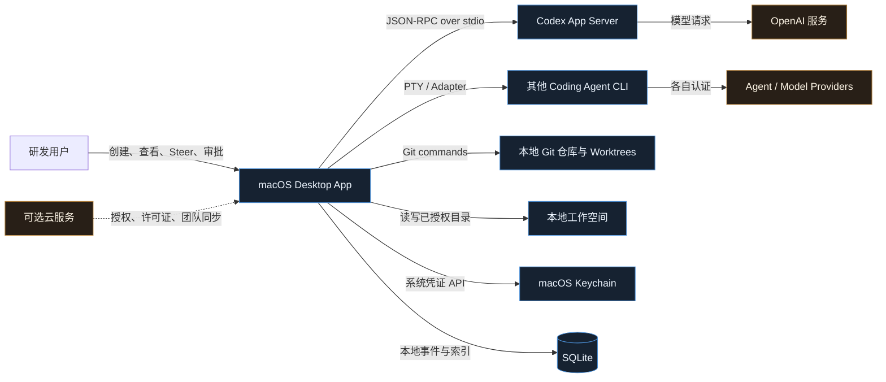

蓝色组件属于本地可信边界；云服务是后续可选能力，不在核心执行链路上。

## 4. 技术选型

| 层 | MVP 选择 | 理由 | 备选方案 |
|---|---|---|---|
| 桌面容器 | Tauri 2 | 复用 React；Rust 适合进程、文件和 Git；后续可支持 Windows | Electron；纯 SwiftUI |
| UI | React + TypeScript | 当前 Demo 可迁移；生态成熟 | Svelte / Vue |
| 状态管理 | Zustand + TanStack Query | 本地事件状态与异步命令分离 | Redux Toolkit |
| 终端渲染 | xterm.js | 成熟的 Web Terminal 组件 | 自研终端不建议 |
| 本地核心 | Rust + Tokio | 适合长连接、子进程、并发事件流和资源治理 | Node sidecar |
| Codex 接入 | App Server stdio | 默认传输方式；结构化 Thread、Turn、Item 事件 | WebSocket 仅用于远程场景 |
| 通用 Agent 接入 | PTY Adapter | 兼容只提供 CLI 的 Agent | 供应商 SDK |
| 本地数据库 | SQLite WAL | 零运维、可事务化、适合单机事件与索引 | DuckDB 不适合作为主事务库 |
| 文本检索 | SQLite FTS5 | 足够支持 MVP 的关键词和 BM25 检索 | Tantivy |
| 语义检索 | 延后；可选 sqlite-vec | 避免过早引入向量服务 | Qdrant / LanceDB |
| Git | 系统 Git CLI + 严格参数构造 | 与用户已有凭证和配置兼容 | libgit2 可在后期评估 |
| 本地日志 | tracing + rolling files | Rust 结构化日志与故障定位 | OpenTelemetry 后续接入 |
| 密钥 | macOS Keychain | 不在 SQLite 或配置文件中保存 Token | 用户环境变量 |

Tauri 的文件系统插件默认阻止危险访问，并要求为命令配置权限和路径 Scope；这符合“用户选择项目目录后才授权”的模型。[Tauri File System](https://v2.tauri.app/plugin/file-system/) SQLite WAL 允许读写并发，但仍只有一个 Writer，因此数据库写入统一经过 Local Core 的单写者队列。[SQLite WAL](https://www.sqlite.org/wal.html)

## 5. 本地进程拓扑

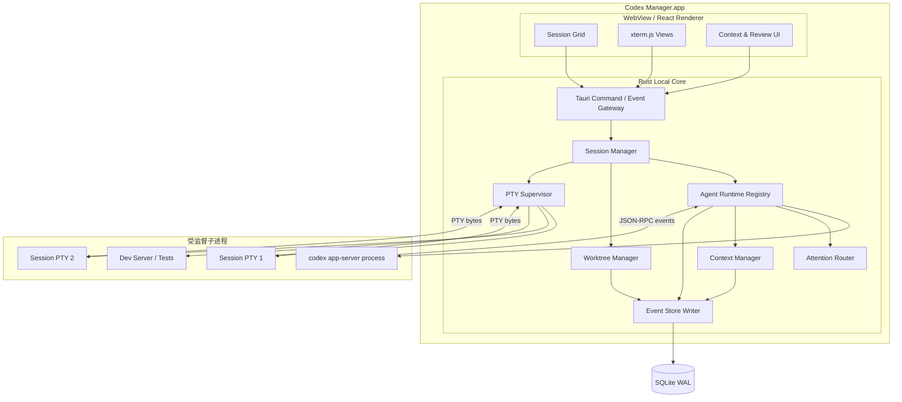

### 5.1 进程职责

#### React Renderer

- 只负责视图、交互和短生命周期 UI State。
- 不直接访问任意文件路径。
- 不直接拼接 Shell 命令。
- 不保存 Provider Token。
- 只接收经过标准化、脱敏和权限检查的数据。

#### Rust Local Core

- 是唯一拥有文件、Git、进程、SQLite 和 Keychain 权限的组件。
- 启动和监督 Codex App Server、PTY 与开发服务器。
- 将所有供应商事件标准化为统一 Domain Event。
- 执行状态机、审批门禁、Attention Router 和 Context 发布。
- 崩溃恢复时重建 Session 与 Process Registry。

#### Codex App Server

- MVP 使用每个 App 一个共享 App Server 进程，而不是每个 Session 一个进程。
- 同一个 App Server 可承载多个 Thread；Session 与 `threadId` 一一关联。
- 使用 stdio JSONL，避免首版依赖实验性的 WebSocket 传输。
- 通过 Adapter 固定版本兼容范围，不让原始协议对象进入 UI。

## 6. 核心领域模型

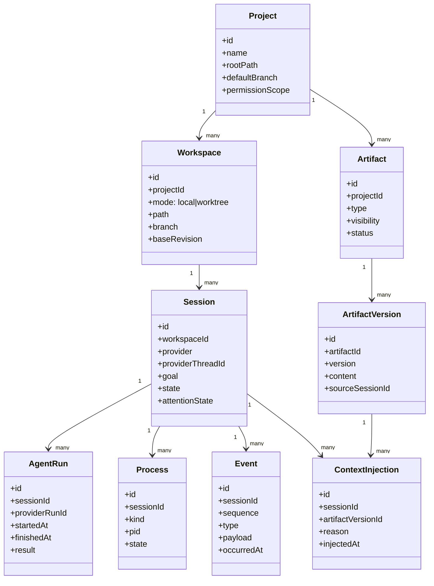

### 6.1 Session 与 Workspace 的关系

- **Session**：一次独立 Codex 对话及其运行生命周期。
- **Workspace**：Session 实际读写的文件目录。
- 一个 Workspace 可以承载多个只读或强协作 Session。
- 默认情况下，一个可独立交付的写任务创建一个 Worktree Workspace。
- 允许用户显式选择 `Shared Local`，但 UI 必须显示文件冲突风险。

## 7. Session 状态机

供应商状态不能直接作为产品状态。产品需要将 Provider Event、PTY 状态、审批请求和进程健康综合成统一状态。

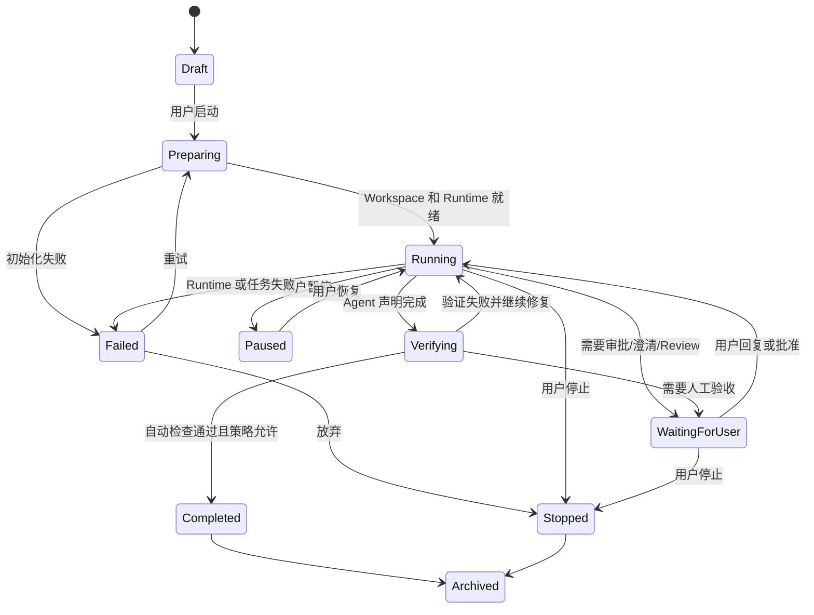

### 7.1 Attention State

执行状态之外，额外维护一个供人类调度的 `attention_state`：

| 状态 | 触发条件 | UI 优先级 |
|---|---|---:|
| `approval_required` | Provider 发出审批请求 | P0 |
| `decision_required` | Agent 明确向用户提问 | P0 |
| `verification_failed` | Test、Build 或验收策略失败 | P1 |
| `suspected_stall` | 长时间无新事件且进程仍存活 | P1 |
| `conflict_detected` | 与其他 Worktree 或共享 Artifact 冲突 | P1 |
| `ready_for_review` | 有 Diff/结果等待验收 | P2 |
| `none` | 正常执行或无需处理 | 不打扰 |

Attention Router 必须以确定性规则为主，LLM 分类只作为补充，避免用另一个不可预测 Agent 决定是否打扰用户。

## 8. 创建与运行 Session 的事件序列

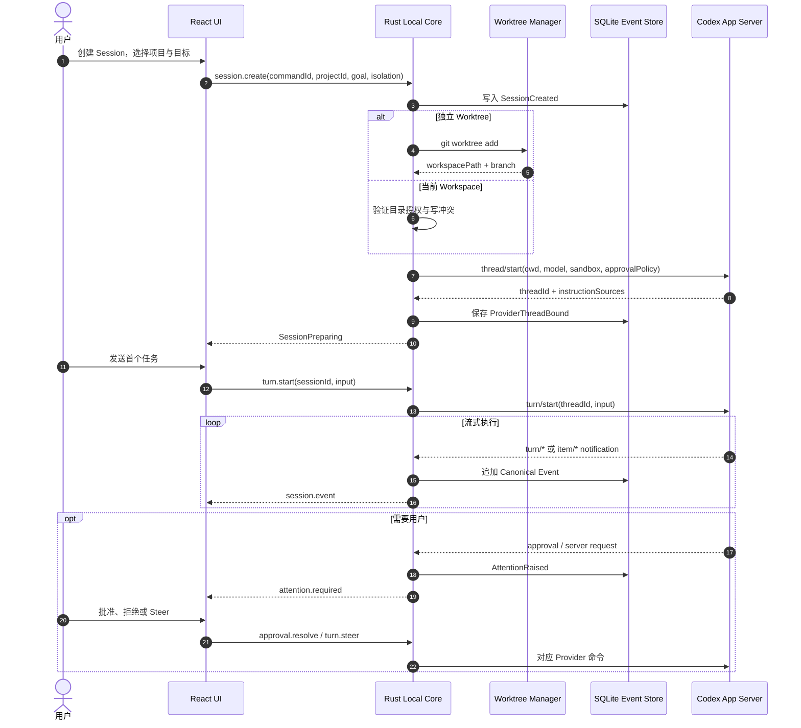

### 8.1 幂等要求

- 所有 UI Command 带 `commandId`，防止双击和重试造成重复 Session。
- Provider Event 以 `(provider_thread_id, provider_event_id)` 或本地 Sequence 去重。
- Git Worktree 创建使用预先生成且持久化的 Workspace ID。
- 状态由事件归约得到，不能仅依赖进程内对象。

## 9. Codex Adapter 映射

官方 App Server 将核心对象分为 Thread、Turn 和 Item，并通过通知流返回 Agent Message、命令、文件修改和工具调用。[Codex App Server](https://learn.chatgpt.com/docs/app-server)

| 产品动作 | App Server 能力 | MVP |
|---|---|---:|
| 新建 Session | `thread/start` | 是 |
| 恢复 Session | `thread/resume` | 是 |
| 读取 Session | `thread/read` / `thread/list` | 是 |
| 分叉方案 | `thread/fork` | 第二阶段 |
| 发起任务 | `turn/start` | 是 |
| 执行中追加要求 | `turn/steer` | 是 |
| 中断执行 | `turn/interrupt` | 是 |
| 监听状态 | `thread/status/changed`、`turn/*`、`item/*` | 是 |
| 管理目标 | `thread/goal/*` | 第二阶段 |
| 长上下文压缩 | `thread/compact/start` | 第二阶段 |
| 动态 Tool | `dynamicTools` | 暂缓；实验能力 |
| WebSocket 远程连接 | `--listen ws://...` | 暂缓；实验能力 |

### 9.1 Adapter 接口

```rust
#[async_trait]
pub trait AgentRuntimeAdapter {
    async fn start_session(&self, request: StartSession) -> Result<ProviderSession>;
    async fn resume_session(&self, provider_id: &str) -> Result<ProviderSession>;
    async fn start_turn(&self, request: StartTurn) -> Result<ProviderTurn>;
    async fn steer(&self, request: SteerTurn) -> Result<()>;
    async fn interrupt(&self, provider_turn_id: &str) -> Result<()>;
    async fn resolve_approval(&self, request: ApprovalDecision) -> Result<()>;
    fn subscribe(&self, provider_session_id: &str) -> EventStream;
}
```

`CodexAdapter`、`ClaudeCodeAdapter` 和未来其他 Adapter 都输出统一事件：

```text
SessionStateChanged
AgentMessageDelta
CommandStarted / CommandOutput / CommandFinished
FileChangeProposed
ApprovalRequested / ApprovalResolved
ContextPublished / ContextInjected
VerificationStarted / VerificationFinished
AttentionRaised / AttentionCleared
```

### 9.2 不直接适配“窗口”，而是适配运行时协议

这里需要把三个概念拆开：

| 层级 | 我们控制什么 | 是否依赖供应商 UI |
|---|---|---:|
| Session Control | 创建、恢复、Steer、中断、审批、状态与用量 | 否 |
| Terminal View | 在自己的 xterm.js 中展示 PTY、命令输出和交互 | 否 |
| External Window Automation | 操作 Codex/Claude 自己的桌面窗口、按钮和 DOM | 是 |

正式产品只承诺前两层。我们在自己的 App 中启动供应商的 App Server、SDK 或 CLI 子进程，并把它们的结构化事件渲染成统一 Session UI；不通过截图、坐标点击、AppleScript 或 DOM Selector 控制对方窗口。第三层最多作为实验性导入工具，因为任何 UI 改版都会破坏它。

### 9.3 Provider Adapter 采用 Sidecar 插件，而不是动态链接库

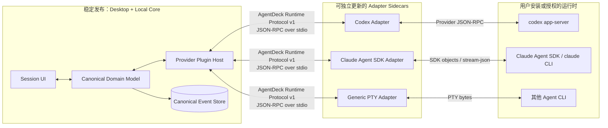

Sidecar 是独立进程插件，每个 Adapter 可以用 TypeScript、Rust 或其他语言实现。它们通过自有的、版本化的 `AgentDeck Runtime Protocol` 与 Local Core 通信。这里不采用 Rust `dylib` 插件，原因是动态库 ABI、崩溃隔离、依赖冲突和签名升级都更难管理。

目录结构示意：

```text
provider-adapters/
├── codex/
│   ├── manifest.json
│   ├── adapter
│   ├── provider-schemas/
│   └── fixtures/
├── claude-agent-sdk/
│   ├── manifest.json
│   ├── adapter
│   └── fixtures/
└── generic-pty/
    ├── manifest.json
    └── adapter
```

每个 `manifest.json` 至少声明：

```json
{
  "id": "com.agentdeck.runtime.codex",
  "adapterVersion": "1.4.2",
  "runtimeProtocol": ">=1.0 <2.0",
  "provider": "codex",
  "providerVersions": ">=0.120 <0.160",
  "entrypoint": "./adapter",
  "permissions": ["spawn-process", "workspace-read-write"],
  "capabilities": [
    "session.create",
    "session.resume",
    "turn.steer",
    "approval.resolve",
    "event.structured"
  ]
}
```

### 9.4 以 Capability 协商替代大量版本判断

Local Core 不写 `if provider == codex` 之类的业务分支。Adapter 启动后先完成握手，报告自己**实际探测到**的能力：

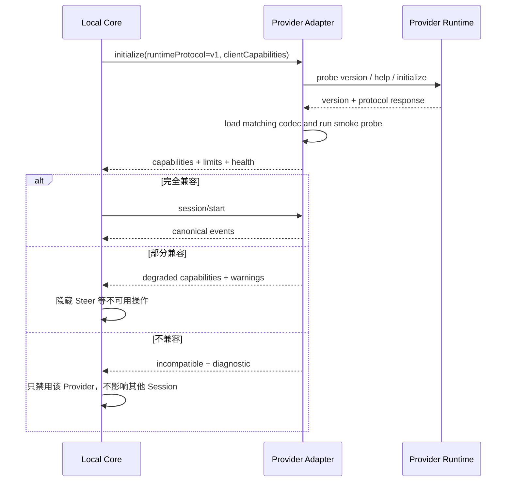

能力键保持细粒度，例如：

```text
session.create
session.resume
session.fork
turn.start
turn.steer
turn.interrupt
approval.resolve
event.structured
event.subagent
context.compaction
usage.tokens
usage.cost
worktree.native
terminal.attach
```

UI 按 Capability 决定展示什么按钮；Attention Router 也只消费统一事件，不理解某个供应商的私有字段。

### 9.5 Codex 与 Claude 的首选接入路径

| Provider | 首选接入 | 次选接入 | 不建议作为主链路 |
|---|---|---|---|
| Codex | `codex app-server` stdio JSON-RPC | Codex SDK | 解析 TUI 屏幕或私有会话文件 |
| Claude | Claude Agent SDK（TypeScript sidecar） | `claude -p --input-format stream-json --output-format stream-json` | 自动点击 Claude Desktop / CLI TUI |
| Grok Build 等 ACP Agent | Agent Client Protocol v1 | Provider Headless JSON | 解析 TUI 屏幕 |
| OpenCode | Local Server + Type-safe SDK/SSE | ACP（若对应版本支持） | 读取 Desktop 私有状态文件 |
| 未知 CLI | 官方结构化输出或 SDK | PTY + Exit Code + 文件/Git 观察 | 基于终端文案做强语义判断 |

Codex App Server 官方支持在当前安装版本上执行 `generate-ts` 或 `generate-json-schema`，生成物与该 Codex 版本精确对应。Adapter 安装或发现版本变化时，可以重新生成 Schema、编译 Codec 并运行 Contract Test，而不必等桌面主程序发版。[Codex App Server](https://learn.chatgpt.com/docs/app-server)

Claude Agent SDK 提供 Python/TypeScript 的 Agent Loop、Session 恢复/分叉、权限、Hooks、Subagent 与 MCP；当 Adapter 使用其他语言时，官方建议把 CLI 作为子进程并使用 JSON 输出。Claude Code CLI 还提供 `stream-json`、`--resume`、Hook 生命周期事件等接口，可作为本地适配层的结构化信号。[Claude Agent SDK](https://code.claude.com/docs/en/agent-sdk/overview) [Claude Code CLI](https://code.claude.com/docs/en/cli-usage) [Claude Code Hooks](https://code.claude.com/docs/en/hooks)

注意：第三方产品使用 Claude Agent SDK 时，官方当前要求使用 API Key 认证，未经批准不能把 claude.ai 登录或其 Rate Limit 提供给第三方用户。因此 Claude Adapter 的认证与商业模式必须单独验证，不能假设可以直接复用用户的 Claude 消费版订阅。[Claude Agent SDK](https://code.claude.com/docs/en/agent-sdk/overview)

Agent Client Protocol（ACP）应成为第一个标准 Adapter：它通过 `initialize.protocolVersion` 协商 Wire Protocol，并通过 Capability 决定可选能力，正好对应本架构的热插拔模型。Grok Build 已把 ACP 作为官方嵌入方式；Codex 和 Claude 则继续保留 Native Adapter，以使用各自更完整的 Thread、审批和事件能力。[Agent Client Protocol](https://github.com/agentclientprotocol/agent-client-protocol) [Grok Build](https://github.com/xai-org/grok-build)

### 9.6 抗上游迭代的六道隔离层

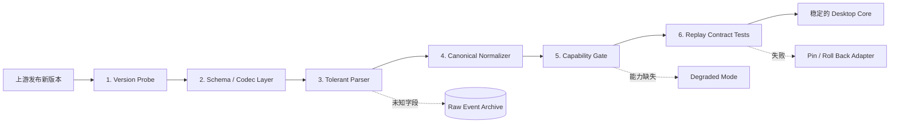

1. **Version Probe**：每次启动记录 Provider 二进制路径、版本和握手结果，而不是依赖用户填写。
2. **Schema / Codec Layer**：供应商原始类型只存在于 Adapter 内；Codex Schema 按已安装版本生成并缓存。
3. **Tolerant Parser**：新增字段忽略但保留；未知事件存入 Raw Event，不让整个 Stream 崩溃。
4. **Canonical Normalizer**：只把确认理解的语义映射为稳定事件；原始 Payload 不进入 UI 业务逻辑。
5. **Capability Gate**：缺少某项能力时仅隐藏或降级相关功能，而不是判定整个 Provider 不可用。
6. **Replay Contract Tests**：保存脱敏的真实事件 Fixture，对 Adapter 新旧版本做重放和差异检查。

Canonical Event 也需要版本化，并遵循“新增优先、删除延后”：

```json
{
  "schema": "agentdeck.event/v1",
  "eventId": "evt_01...",
  "sessionId": "ses_01...",
  "type": "approval.requested",
  "occurredAt": "2026-09-06T12:00:00Z",
  "provider": {
    "id": "codex",
    "runtimeVersion": "0.x",
    "adapterVersion": "1.4.2",
    "rawEventRef": "raw_01..."
  },
  "payload": {}
}
```

### 9.7 Adapter 热更新与无损切换

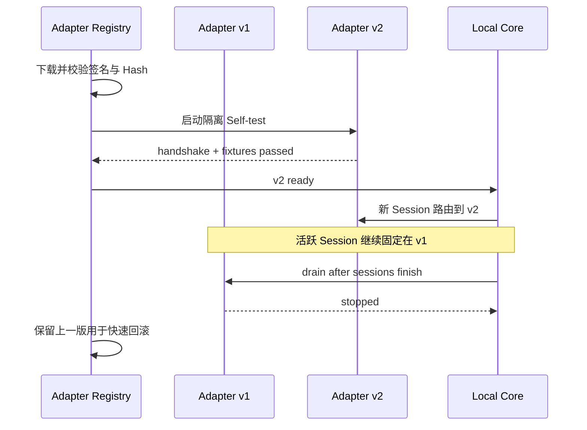

热插拔的边界是 **Session**：

- 新 Adapter 上线后，新 Session 立即使用新版本。
- 已运行 Session 固定在创建它的 Adapter 版本，避免事件语义在中途改变。
- 安全兼容的补丁可在 Session idle 后执行 `resume` 迁移，但必须通过 Adapter 明确声明。
- Adapter 崩溃时，Plugin Host 只重启该 Sidecar；其他 Provider 和 UI 不受影响。
- 更新包必须签名、校验 Hash，并保留上一稳定版；MVP 可先随桌面应用内置，商业版再开放独立更新通道。

### 9.8 Provider 更新探测与发布门禁

每个 Adapter 维护自己的兼容矩阵：

| 状态 | 判断条件 | 产品行为 |
|---|---|---|
| Verified | 已通过该 Provider 版本的握手、Fixture 与真实 Smoke Test | 全能力启用 |
| Compatible | 版本未知，但握手与必需能力探测通过 | 允许使用并提示“未认证版本” |
| Degraded | 核心能力可用，部分能力或事件不兼容 | 隐藏相关操作，保留终端与基础任务 |
| Incompatible | 无法握手或核心事件无法归一化 | 禁用该 Adapter，给出诊断和回滚入口 |

这套设计不能让维护成本归零，但可以限制改动半径：

| 上游变化 | 通常需要的动作 | Desktop 是否发版 |
|---|---|---:|
| 新增字段或未知事件 | Tolerant Parser 保留 Raw Event，观察后再映射 | 否 |
| CLI 参数、事件名或 Schema 改动 | 更新对应 Adapter 与 Fixture | 否 |
| 新增供应商能力 | Adapter 声明新 Capability，通用 UI 已支持则自动出现 | 通常否 |
| 核心语义变化 | 升级 Canonical Protocol，并提供兼容迁移 | 可能需要 |
| 需要全新交互组件 | 扩展 Desktop UI | 是 |

发布流水线每天或在发现新版本后执行：

```text
discover latest provider version
→ install in clean runner
→ generate/fetch schema
→ run handshake contract
→ replay historical fixtures
→ run create / resume / interrupt / approval smoke tests
→ publish signed adapter compatibility metadata
```

因此，大多数上游变化的处理成本会落在一个小型 Adapter 仓库和自动化测试上；只有供应商改变了核心语义时，才需要升级 Canonical Protocol 或 Desktop Core。

## 10. Worktree 管理

Git 官方允许同一 Repository 同时拥有多个 Working Tree，使不同分支能并行 Checkout。[git-worktree](https://git-scm.com/docs/git-worktree) Codex 官方也使用 Worktree 运行互不干扰的独立聊天。[Codex Worktrees](https://learn.chatgpt.com/docs/environments/git-worktrees)

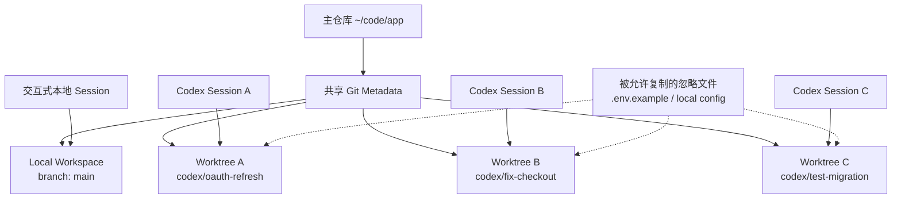

### 10.1 Worktree 策略

- 默认路径：`~/Library/Application Support/<product>/worktrees/<project-id>/<workspace-id>`。
- 默认分支：`codex/<slug>-<short-id>`，创建前检查冲突。
- 创建前记录 Base SHA，供后续 Diff、Rebase 风险和结果归属判断。
- `.env`、依赖和 Git ignored 文件不默认复制。
- 项目可声明 allowlist，例如 `.agentdeck/worktree.toml`。
- 删除前验证：无运行进程、无未确认修改、无未保存 Artifact。
- 删除优先调用 `git worktree remove`，失败时标记 `cleanup_required`，不直接递归删除目录。

### 10.2 并行冲突检测

MVP 使用轻量规则：

1. Session 启动后持续记录 Changed File Set。
2. 两个活动 Session 修改相同文件时立即标黄。
3. 两个 Worktree 的 Base SHA 差距扩大时提示更新风险。
4. 合并前执行 `git merge-tree` 或临时预合并检查。
5. Artifact 声明涉及的 API/Schema 文件发生变化时，通知订阅 Session。

## 11. 共享上下文架构

共享上下文不是一个所有 Session 都能随意写入的大 Prompt，而是一条带治理的本地 Context Bus。

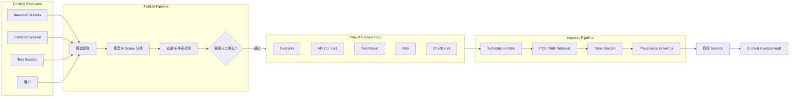

### 11.1 Artifact 类型

| 类型 | 示例 | 默认有效期 | 默认发布方式 |
|---|---|---:|---|
| `decision` | 保留旧版 401 行为 | 项目长期 | 人工确认 |
| `api_contract` | `/auth/refresh` v1.2 | 到新版本替代 | Diff 检测后确认 |
| `schema` | 数据库字段和迁移约束 | 到新版本替代 | 人工确认 |
| `test_result` | 集成测试 11/11 通过 | 与 Commit 绑定 | 自动发布，可撤销 |
| `risk` | 并发 401 触发重复刷新 | 直到关闭 | 自动建议、人工确认 |
| `checkpoint` | 当前实现阶段和下一步 | Session 生命周期 | 自动生成 |
| `code_reference` | 文件、符号、Commit、Diff | 与 Revision 绑定 | 自动发布 |
| `instruction` | 编码规范和项目约束 | 项目长期 | 只允许用户/项目配置发布 |

### 11.2 Scope

```text
private(session)  →  project  →  organization  →  global-user
```

MVP 只实现 `private` 和 `project`。每个 Artifact 需要保存：

- `source_session_id`
- `source_event_id`
- `source_revision`
- `artifact_type`
- `visibility`
- `status: draft | verified | superseded | expired`
- `version`
- `content_hash`
- `created_by: user | agent | rule`
- `valid_from` / `valid_until`

### 11.3 注入规则

第一版采用确定性规则与 FTS，而不是一开始就把所有内容做 Embedding：

1. 当前 Session 显式订阅的 Artifact 类型优先。
2. 与目标文件、Symbol 或目录匹配的 Artifact 优先。
3. `verified` 高于 `draft`；新版本高于旧版本。
4. 已被 `superseded` 或与当前 Git Revision 不兼容的内容禁止注入。
5. 每次注入保存 `ContextInjection`，记录原因、版本和 Token 预算。
6. UI 必须允许用户查看“这条上下文为什么出现在此会话”。

注入给 Agent 的内容使用稳定信封：

```xml
<shared_context project="identity-service" generated_at="...">
  <artifact id="ctx_api_refresh" version="3" type="api_contract"
            source_session="ses_backend" source_revision="7f3a2c1"
            status="verified">
    ...normalized content...
  </artifact>
</shared_context>
```

## 12. 事件架构

### 12.1 Event Sourcing 的使用边界

不需要构建复杂分布式 Event Sourcing 平台，但 Session 运行日志适合使用 Append-only Event 表：

- 能在应用重启后恢复 Session UI。
- 能追踪一次状态判断来自什么 Provider Event。
- 能重放 Attention Router 和上下文提取规则。
- 能为 Debug、评测和用户申诉保留证据。

常用读取模型由本地投影表提供，不在 UI 每次打开时重放全部历史。

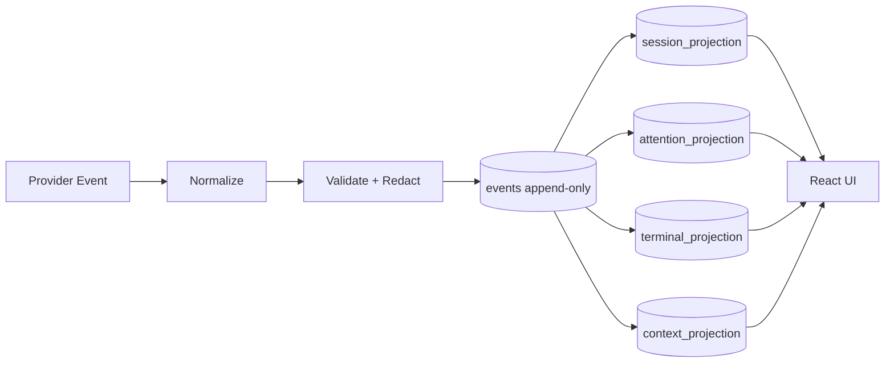

### 12.2 事件保留

- 终端原始字节流不永久逐字节写库；按 Chunk 压缩并设置上限。
- Agent Message、命令元数据、文件变更、审批和状态事件长期保存。
- 支持用户按 Project 或 Session 清除历史。
- 日志写入前执行 Secret Redaction；源文件内容默认不进入运行日志。

## 13. SQLite 数据设计

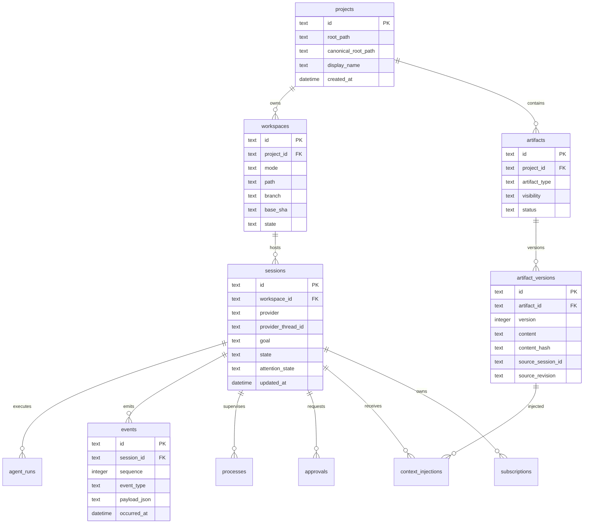

建议开启：

```sql
PRAGMA journal_mode = WAL;
PRAGMA foreign_keys = ON;
PRAGMA busy_timeout = 5000;
```

所有写请求进入单个异步 Writer，批量写终端与流式事件；UI 查询使用独立只读连接。

## 14. UI 与 Local Core 通信

### 14.1 Command

Command 是有结果、可审计的用户意图：

```ts
type DesktopCommand =
  | { type: "session.create"; commandId: string; projectId: string; goal: string; isolation: "worktree" | "local" }
  | { type: "session.startTurn"; commandId: string; sessionId: string; text: string }
  | { type: "session.steer"; commandId: string; sessionId: string; text: string }
  | { type: "session.interrupt"; commandId: string; sessionId: string }
  | { type: "approval.resolve"; commandId: string; approvalId: string; decision: "allow" | "deny" }
  | { type: "context.publish"; commandId: string; candidateId: string; visibility: "private" | "project" };
```

### 14.2 Event

Event 是 Local Core 发给 UI 的事实：

```ts
type DesktopEvent = {
  eventId: string;
  sessionId?: string;
  sequence: number;
  type: string;
  occurredAt: string;
  payload: unknown;
};
```

规则：

- UI 只发送结构化 Command，不发送任意 Shell 字符串。
- Rust 对路径做 Canonicalize 并验证属于已授权 Project。
- 每个 Session 的 Event 保序，不要求所有 Session 全局严格排序。
- UI 断线重连时提交最后 Sequence，从 SQLite 补齐缺失事件。
- 高频终端流与低频领域事件使用不同 Channel，避免终端刷屏阻塞审批事件。

## 15. 安全与权限边界

```mermaid
flowchart TB
    subgraph Untrusted[低信任输入]
        USER[用户 Prompt]
        REPO[仓库内容 / AGENTS.md]
        OUT[Agent 与终端输出]
        MCP[MCP / 外部工具结果]
    end

    subgraph UITrust[Renderer Boundary]
        RENDER[React WebView]
    end

    subgraph CoreTrust[Local Core Boundary]
        GW[Command Gateway]
        AUTHZ[Path + Action Authorization]
        APPROVAL[Approval Engine]
        REDACT[Secret Redaction]
        SUP[Process Supervisor]
    end

    subgraph Host[Host Resources]
        FILES[Authorized Project Paths]
        SHELL[Shell / Git / PTY]
        SECRET[Keychain]
        NET[Network]
    end

    USER --> RENDER
    REPO --> GW
    OUT --> GW
    MCP --> GW
    RENDER --> GW --> AUTHZ
    AUTHZ --> APPROVAL
    APPROVAL --> SUP
    SUP --> FILES
    SUP --> SHELL
    SUP --> NET
    GW --> REDACT
    REDACT --> DB[(Local Event DB)]
    AUTHZ --> SECRET
```

### 15.1 安全规则

1. WebView 不具备任意文件和进程权限。
2. 用户通过系统目录选择器授权 Project Root；权限只扩展到明确范围。
3. 禁止 UI 传入 `bash -c <string>`；命令采用程序名和参数数组。
4. 执行破坏性 Git/文件操作前显示确切目标和影响。
5. Provider Token、许可证 Token 和远程凭证保存在 Keychain。
6. SQLite 不保存完整环境变量。
7. 终端输出中的 Token、Cookie、Authorization Header 和常见 Secret Pattern 在落盘前脱敏。
8. App Server 使用 stdio 或本地 Unix Socket；远程监听默认关闭。
9. 外部链接、OSC 终端链接和文件跳转必须经过协议与路径校验。
10. 自动 Context 发布不能将 `instruction` 类型内容提升到 Project Scope。

## 16. 故障恢复

| 故障 | 恢复策略 |
|---|---|
| React WebView 重载 | 从 Projection 重新加载；用 Sequence 补事件 |
| Desktop App 崩溃 | 下次启动扫描未终止 Session、Process 和 Worktree |
| App Server 崩溃 | 指数退避重启；尝试 `thread/resume`；失败则标记人工处理 |
| Agent 子进程退出 | 保存 Exit Code、最后日志和 Workspace 状态 |
| SQLite Busy | 单 Writer + Busy Timeout + 有界重试 |
| Worktree 创建一半失败 | 执行补偿清理；保留审计记录 |
| UI 误重复提交 | `commandId` 幂等表返回第一次结果 |
| Provider 协议升级 | Adapter 版本探测；未知事件原样归档但不改变领域状态 |
| 孤儿进程 | 比对 PID、启动签名和 Workspace，不仅凭 PID 杀进程 |
| 上下文版本冲突 | 保留两个 Version，标记 Conflict，等待用户或规则解决 |

## 17. 性能和容量目标

这些是产品工程目标，不是已完成 Benchmark：

| 指标 | MVP 目标 |
|---|---:|
| 冷启动到可交互 | ≤ 2 秒（Apple Silicon 开发机） |
| Session 状态事件到 UI | P95 ≤ 150 ms |
| Terminal 输出到 UI | P95 ≤ 100 ms，允许批量刷新 |
| 同时活动 Session | 8 个 |
| 同时可见 Terminal | 4 个，其他降采样或后台缓存 |
| 本地事件库 | 单 Project 100 万事件仍可分页浏览 |
| UI 主线程 | 长任务期间保持 50+ FPS |
| 崩溃后状态恢复 | ≤ 5 秒完成扫描与投影加载 |
| Context 检索 | P95 ≤ 100 ms（FTS5） |

资源治理：

- 每个 Session 维护 CPU、内存、输出速率和子进程数。
- Terminal Chunk 使用背压和环形缓冲区。
- 只为可见会话保留高频渲染；后台会话按 250–500ms 聚合事件。
- Dev Server 和测试进程由用户显式启动，不随每个 Agent 自动复制。

## 18. 可观测性

### 18.1 本地指标

- Session 启动成功率和耗时。
- Provider 连接/恢复失败率。
- Event Lag、Terminal Drop、SQLite Write Latency。
- Worktree 创建、清理和冲突率。
- Attention 触发准确率和用户响应时间。
- Context 发布、接受、撤销和命中率。
- 每个成功交付的运行时间、人工介入次数和 Token/费用（Provider 可提供时）。

### 18.2 隐私默认值

- Telemetry 默认只发送聚合技术指标，不发送源码和 Prompt。
- 崩溃报告附带的数据在发送前可预览。
- Session Trace 导出由用户显式触发并支持脱敏。
- 首版允许完全关闭网络 Telemetry。

## 19. 未来云端架构

本地产品跑通后再加入轻量云控制面，不搬走本地执行核心。

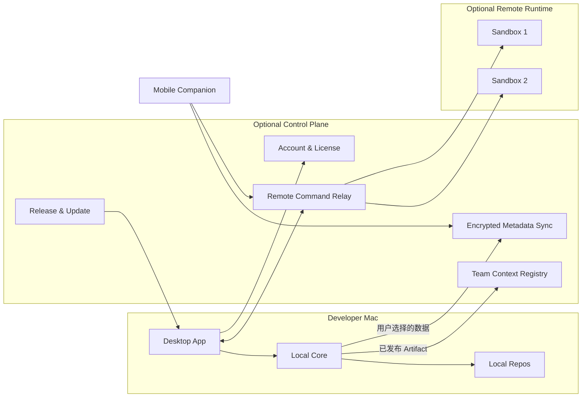

云端第一批能力应该是许可证、更新、加密元数据同步和移动端审批。云端 Sandbox、多用户协同和组织知识库属于后期能力。

## 20. 仓库建议结构

```text
codex-manager/
├── apps/
│   └── desktop/
│       ├── src/                    # React UI
│       ├── src-tauri/              # Tauri bootstrap / capabilities
│       └── tests/                  # Playwright desktop smoke tests
├── crates/
│   ├── domain/                     # Session / Event / Artifact types
│   ├── local-core/                 # orchestration facade
│   ├── event-store/                # SQLite repositories + migrations
│   ├── runtime-api/                # AgentRuntimeAdapter trait
│   ├── runtime-plugin-host/        # Sidecar lifecycle / handshake / routing
│   ├── runtime-codex/              # Codex App Server adapter
│   ├── runtime-claude/             # Claude Agent SDK adapter launcher
│   ├── runtime-pty/                # generic CLI / PTY adapter
│   ├── worktree-manager/           # Git worktree lifecycle
│   ├── attention-router/           # deterministic attention rules
│   ├── context-manager/            # artifact publish/retrieve/inject
│   └── security/                   # scopes, redaction, keychain
├── packages/
│   ├── ui/                         # design system
│   ├── protocol/                   # generated TS command/event types
│   └── test-fixtures/               # replayable provider event streams
├── provider-adapters/
│   ├── codex/                      # manifest / executable / schemas
│   ├── claude-agent-sdk/           # TS sidecar and fixtures
│   └── generic-pty/                # 最低能力兜底
├── docs/
│   ├── architecture/
│   ├── adr/
│   └── threat-model/
└── scripts/
```

Rust 与 TypeScript 协议类型建议从同一 Schema 生成，避免手工维护两套事件结构。

## 21. 测试策略

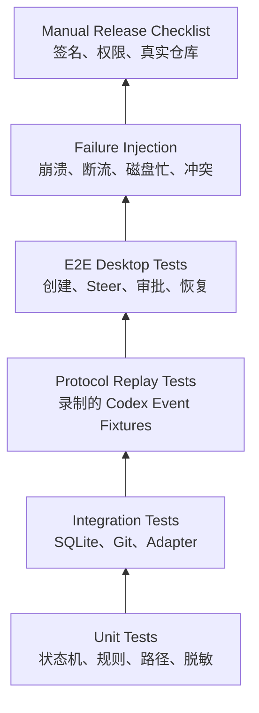

优先测试内容：

- State Reducer 的所有合法和非法迁移。
- App Server 事件乱序、重复和未知字段。
- Worktree 中断和补偿清理。
- 同文件跨 Session 修改冲突。
- Secret Redaction 不漏常见 Token。
- Renderer 无法绕过 Path Scope。
- App 重启后 Thread Resume 与 UI 投影一致。
- 共享 Artifact 被替代后不再注入旧版本。

## 22. MVP 交付阶段

### Phase 0：现有交互 Demo

- 已有多会话 Grid、筛选、Steer、暂停和 Inspector。
- 全部为浏览器 Mock。

### Phase 1：真实本地单供应商闭环

目标：证明 Mac App 能可靠管理 2–4 个真实 Codex Session。

- Tauri 壳和目录授权。
- 启动 Codex App Server。
- Thread 创建、读取、恢复、Turn、Steer 和 Interrupt。
- 结构化事件映射。
- SQLite Event Store。
- 每个 Session 独立 Worktree。
- 基础 Diff 和 Waiting for Approval UI。

验收：在真实 Repository 中同时完成两个互不相关的小任务，重启 App 后可恢复。

### Phase 2：注意力调度

- Waiting、Failure、Suspected Stall、Ready for Review 分类。
- 全局 Inbox。
- 批量审批仅支持明确低风险动作。
- Session 健康和资源占用。

验收：用户无需逐个打开 Session 即可处理所有阻塞点。

### Phase 3：共享上下文池

- Context Candidate、人工发布、订阅与版本。
- API Contract、Decision、Risk、Test Result 四类 Artifact。
- FTS5 检索与确定性注入。
- 来源和注入历史 UI。
- 共享上下文冲突检测。

验收：Backend 发布 API Contract 后，Frontend Session 能收到正确版本，且用户可以追溯来源。

### Phase 4：多供应商与商业验证

- 增加一个通用 PTY Adapter 或 Claude Code Adapter。
- 统一成本、状态、审批和结果模型。
- 签名 DMG、自动更新、许可证。
- 小规模设计合作伙伴测试。

## 23. 关键风险与对策

| 风险 | 影响 | 对策 |
|---|---|---|
| Codex App Server 协议变化 | 集成失效 | Adapter 隔离、版本探测、Fixture Replay；避免实验字段 |
| 原生产品快速覆盖多会话 | 产品同质化 | 聚焦跨 Provider、Attention Router 和 Context Provenance |
| Worktree 缺少 `.env`/依赖 | Session 启动失败 | 项目级 Setup Recipe 和严格复制 Allowlist |
| 多进程资源过载 | 本机卡顿 | 并发额度、后台降频、资源预算和用户可见限流 |
| 上下文污染 | Agent 被错误结论影响 | 显式 Scope、Version、Verified 状态、失效机制和注入审计 |
| Agent 错误操作 | 用户代码受损 | Worktree 隔离、审批策略、Diff Review、可恢复操作 |
| PTY 输出不可结构化 | 状态判断不准确 | Codex 优先结构化 App Server；PTY 只做兼容层 |
| 安全范围过大 | 源码/凭证风险 | 目录授权、Tauri Scope、Keychain、日志脱敏、默认本地 |
| SQLite 事件增长 | 性能和磁盘问题 | Chunk、Retention、Projection、Checkpoint 和归档 |

## 24. Architecture Decision Records

### ADR-001：桌面端采用 Tauri 2

**决定**：保留 React UI，由 Rust 承担本地高权限能力。  
**原因**：后续 Windows 复用、进程治理能力强、权限可以集中在 Core。  
**退出条件**：PTY/WebView 性能或 macOS 系统集成出现无法解决的核心限制。

### ADR-002：Codex 优先使用 App Server stdio

**决定**：不以终端文本解析作为 Codex 主集成方式。  
**原因**：App Server 面向富客户端，提供 Thread/Turn/Item、审批和流式事件。  
**限制**：协议仍需通过 Adapter 隔离，实验能力不进入 MVP 核心路径。

### ADR-003：独立写任务默认 Worktree

**决定**：新 Session 默认创建独立 Worktree。  
**原因**：避免多个 Agent 修改相同 Checkout；结果可独立审查和丢弃。  
**例外**：用户显式选择 Shared Local，或者实现与评审确实需要共享同一 Diff。

### ADR-004：上下文以 Artifact 为共享单位

**决定**：共享 API Contract、Decision、Risk、Test Result 等结构化对象。  
**原因**：完整对话噪声大、成本高、来源不清、容易跨 Session 污染。  
**后续**：只有在真实召回数据证明需要时才增加 Embedding。

### ADR-005：Local Core 为 SQLite 单 Writer

**决定**：UI 与 Adapter 不直接写 SQLite。  
**原因**：保证事件 Sequence、幂等、投影一致性，并适配 SQLite 单 Writer 特性。

### ADR-006：Provider Adapter 使用进程级 Sidecar

**决定**：Adapter 通过版本化 JSON-RPC stdio 协议连接 Plugin Host，不加载供应商动态库。  
**原因**：允许独立开发、发布、崩溃隔离、能力探测、灰度切换和回滚。

### ADR-007：适配结构化运行时，不驱动第三方窗口

**决定**：Codex 和 Claude 的正式适配基于 App Server、Agent SDK 或结构化 CLI Stream。  
**原因**：第三方 UI 自动化依赖坐标、文案和 DOM，无法提供可靠的升级兼容性。

## 25. 待验证问题

1. Codex App Server 在不同 Codex 版本上的兼容窗口和升级策略。
2. 用户现有 Codex 登录态能否在第三方桌面客户端中获得符合条款与预期的体验。
3. 真实用户平均会同时运行多少个 Session：2、4 还是 8 个。
4. 用户需要共享的是代码文件、决策、完整计划，还是最终结果摘要。
5. 自动发布 Context 的误报成本是否高于漏报成本。
6. Attention Router 应以 Provider 结构化状态、进程指标还是语义判断为主。
7. Worktree Setup Recipe 能否覆盖大型 Monorepo、容器和多语言项目。
8. 用户愿意为跨 Agent 编排付费，还是只愿意为团队、云运行与审计付费。
9. Claude Agent SDK 的 API Key 认证约束对 BYOK、订阅复用和商业定价的影响。
10. Adapter 独立热更新在 macOS 签名、公证和企业设备策略下采用哪种分发方式。

## 26. 建议的第一个技术 Spike

用 3–5 天完成一个不追求 UI 的垂直验证：

1. 从 Rust 启动 `codex app-server` stdio 子进程。
2. 完成初始化握手。
3. 创建两个不同 `cwd` 的 Thread。
4. 并行执行两个 Turn，并把事件映射成统一结构。
5. 在其中一个 Turn 执行中发送 Steer。
6. 捕获审批请求和 `waitingOnApproval` 状态。
7. 杀掉桌面进程后重新启动并 Resume 两个 Thread。
8. 将所有 Canonical Event 写入 SQLite，再重建 Session 列表。

这个 Spike 成功后，再把现在的 React Demo 包进 Tauri。失败时也能尽早知道问题出在协议、认证、进程恢复还是权限，而不是 UI。

## 27. 参考资料

- [Codex App Server — official OpenAI documentation](https://learn.chatgpt.com/docs/app-server)
- [Codex Worktrees — official OpenAI documentation](https://learn.chatgpt.com/docs/environments/git-worktrees)
- [Claude Agent SDK Overview](https://code.claude.com/docs/en/agent-sdk/overview)
- [Claude Code CLI Reference](https://code.claude.com/docs/en/cli-usage)
- [Claude Code Hooks Reference](https://code.claude.com/docs/en/hooks)
- [Agent Client Protocol](https://github.com/agentclientprotocol/agent-client-protocol)
- [xAI Grok Build](https://github.com/xai-org/grok-build)
- [OpenCode SDK](https://opencode.ai/docs/sdk/)
- [Tauri File System and permission scopes](https://v2.tauri.app/plugin/file-system/)
- [Tauri Permissions](https://v2.tauri.app/security/permissions/)
- [xterm.js Documentation](https://xtermjs.org/docs/)
- [SQLite Write-Ahead Logging](https://www.sqlite.org/wal.html)
- [Git Worktree Documentation](https://git-scm.com/docs/git-worktree)
