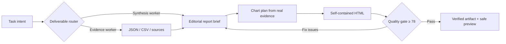

# Agent Deck HTML report system

Agent Deck treats a high-quality HTML deliverable as a compiled report rather than decorated Markdown.

## Editorial contract

- Conclusion-first writing with evidence, implication, and limitation.
- Claim-led headings and connected prose instead of repeated cards and slogans.
- One reading column for narrative and a wider analytical column for figures and tables.
- Natural language matching the reader; Chinese reports avoid generic English dashboard labels.
- Facts, interpretation, recommendations, and uncertainty remain distinguishable.

## Visualization contract

- Charts are selected by analytical question, not decoration.
- Data-rich reports contain two complementary views, or one view plus an exact-value table.
- Every chart carries title, labels/legend, units, scale, source note, and takeaway.
- Numeric values are never invented. Sparse qualitative evidence uses a matrix, timeline, or relationship map.
- Chart datasets are duplicated in the machine-readable `agent-deck-data` block for later agents.

## Publication gate

A verified report must score at least 78 across document foundation, semantic hierarchy, narrative substance, executive synthesis, method and sources, decision and limitations, responsive/print behavior, accessible figures, reusable structured data, evidence visualization, table semantics, and offline safety.

The gate does not judge whether the underlying research is true; acceptance evidence and user review continue to own factual verification.
