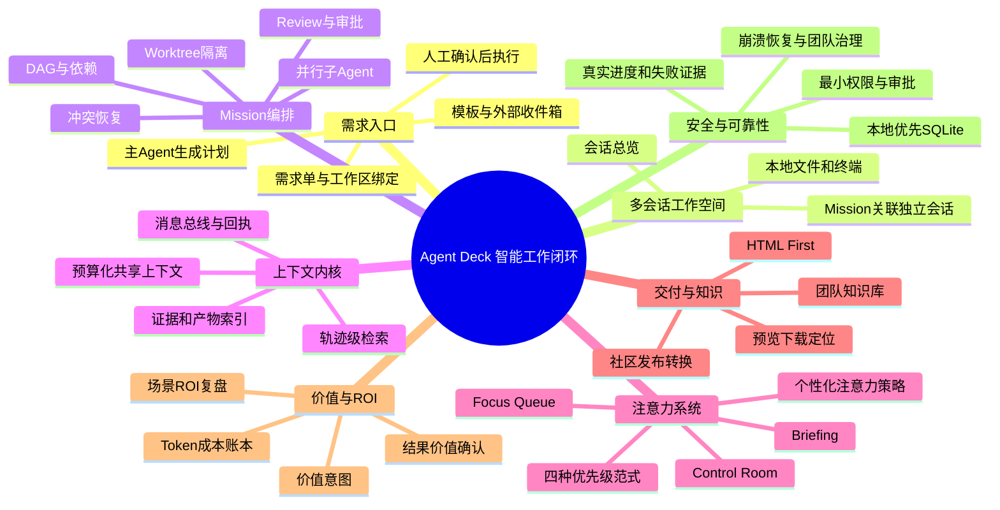

# Agent Deck 产品能力地图

> 定位：本地优先的智能工作桌面。把一次想法转成**可确认计划、可并行执行、可审阅证据、可复用产物和可计算价值**，而不只是多开几个 AI 会话。

## 状态说明

- **已实现**：可在当前桌面包中使用，读取真实本地工作区、SQLite 或 Codex 会话。
- **可用基础**：主链路存在，但交互、异常恢复或跨 Provider 体验仍需打磨。
- **路线图**：已定义，不应宣传为当前可交付能力。

## 思维导图

## 核心闭环

## 能力清单与用例

### 1. 需求入口：把模糊想法变成可执行承诺

| 能力 | 用户用例 | 应有行为 | 状态 |
| --- | --- | --- | --- |
| 需求单 | “做一份可发布的模型架构调研报告。” | 用户填写目标和完成标准；背景、优先级、价值意图均可选。 | 已实现 |
| 工作区绑定 | “这件事必须在 `my-product` 仓库完成。” | 需求绑定本地项目，Mission、产物、终端和授权范围全部继承。 | 已实现 |
| 主 Agent 取单 | “我不想手工拆任务。” | 主 Agent 读取需求与价值约束，先产生计划，不直接改代码。 | 已实现 |
| 人工确认点 | “计划错了就不该开工。” | 计划先进入审阅；确认后才启动 Worker、Worktree 或写操作。 | 已实现 |
| 需求模板 | “每周都做竞品调研 / 周报。” | 按场景预填验收、证据格式、预算和审批规则。 | 路线图 |
| 外部收件箱 | “把飞书、邮件、网页收藏变成需求候选。” | 先进入候选区；用户确认工作区和结果定义后才进入执行。 | 路线图 |

### 2. 多会话与本地工作空间

| 能力 | 用户用例 | 应有行为 | 状态 |
| --- | --- | --- | --- |
| 会话总览 | “调研、修 Bug、写文档同时推进。” | 每张卡只显示目标、当前下一步、风险、最近证据和等待原因，不混淆上下文。 | 已实现 |
| 本地工作区 | “Agent 必须读我的真实代码。” | 展示仓库、分支、Worktree、Thread；文件访问受工作区边界约束。 | 已实现 |
| 终端 | “我要自己运行 bash 调试。” | 有交互式命令输入和输出记录；影响工作区的操作显式呈现。 | 可用基础 |
| Mission 聚合 | “同一大需求下有多个会话。” | Mission 作为关系层，关联会话但保留各自的独立上下文。 | 已实现 |
| Provider 统一入口 | “同一张看板接 Codex、Claude Code、API Agent。” | 统一会话、运行、产物、成本、审批的数据模型；各 Provider 只实现适配器。 | 可用基础 |

### 3. Mission 编排：多 Agent 但不失控

| 能力 | 用户用例 | 应有行为 | 状态 |
| --- | --- | --- | --- |
| 计划 DAG | “调研、实施、测试、报告并行，但有依赖顺序。” | 主 Agent 生成包含负责人、依赖、验收、输出位置的任务图。 | 已实现 |
| 子 Agent 派发 | “资料、代码、质量审查同时进行。” | 每个 Worker 有独立真实会话和任务身份，而非只在主对话中宣称。 | 已实现 |
| Worktree 隔离 | “两个 Agent 不应覆盖同一个文件。” | 高写入风险任务使用隔离工作区；合并前保留 diff 与冲突证据。 | 已实现 |
| 动态增派 | “缺少专项研究时新增专家。” | 新 Worker 必须进入图谱、任务列表、消息总线和上下文索引。 | 可用基础 |
| 依赖冲突恢复 | “上游产物冲突，Mission 不该卡死。” | 识别真实冲突，创建解决任务，写明处理后会释放哪些下游项。 | 已实现 |
| 计划编辑 | “执行前调整拆分、依赖、验收。” | 任务 ID 稳定；已分发任务不可悄然重写，需要变更记录。 | 已实现 |

### 4. 对话、消息总线与人工干预

| 能力 | 用户用例 | 应有行为 | 状态 |
| --- | --- | --- | --- |
| 真实对话可见 | “我要知道 Worker 实际说了什么。” | 请求、回答、验证、阻塞以人读卡片呈现；结构化 JSON 自动整理。 | 已实现 |
| 直接干预 | “方向不对，改为研究性能。” | 对主 Agent 或任意 Worker 直接追问；先显示本地回执，再同步 Provider。 | 已实现 |
| 发送回执 | “点发送后不能不知是否送达。” | 展示排队、已发送、失败原因和可重试动作。 | 已实现 |
| Agent 协作消息 | “Worker 遇到矛盾，要请专家确认。” | 总线记录请求、回复、引用证据和对下游任务的影响。 | 已实现 |
| 阻塞建议 | “Blocked 了，我该对谁说什么？” | 给出阻塞事实、建议对象、建议措辞和会释放的任务。 | 可用基础 |

### 5. 上下文内核：紧密共享，不制造噪音

| 能力 | 用户用例 | 应有行为 | 状态 |
| --- | --- | --- | --- |
| Context Kernel | “子 Agent 要知道已验证结论，但无需读完聊天。” | 按任务目标、依赖产物、已验证事实、当前决策、风险组装预算化摘要。 | 已实现 |
| 可追溯引用 | “这句话的证据来自哪？” | 每条关键事实可跳回消息、文件、命令、测试或产物。 | 已实现 |
| 证据/产物索引 | “后续 Agent 快速找到上游报告。” | HTML、数据文件、代码 diff、验证结果成为 Mission 资产。 | 已实现 |
| Token 预算 | “别让 8 个 Agent 都吃完整上下文。” | 按角色加载最小上下文；长输出保留头尾，并标记中间省略。 | 已实现 |
| 轨迹级检索 | “找到历史上相似的解决路径。” | 对任务、工具调用、决策、证据建立可检索轨迹图，以结构约束和语义召回替代全量回放。 | 路线图 |
| 上下文质量评估 | “共享内容是在帮忙还是制造返工？” | 记录引用率、重复率、返工和 token 代价，优化选择器。 | 路线图 |

### 6. 注意力系统：适配不同工作范式

| 能力 | 用户用例 | 应有行为 | 状态 |
| --- | --- | --- | --- |
| Focus Queue | “现在只想处理一个最重要的决定。” | 每项只讲一个动作、为什么是现在、影响哪些下游任务。 | 已实现 |
| Control Room | “我是负责人，要看全局阻塞。” | 按严重度、状态和 Mission 分组，不加载完整会话历史。 | 已实现 |
| Briefing | “开会前需要一页简报。” | 聚合状态、待决策、已交付、风险和价值账本。 | 已实现 |
| 优先级模式 | “今天优先交付，明天优先风险。” | 护航推进、交付验收、风险控制、价值优先四种排序；只改变展示，不自动执行。 | 已实现 |
| 个性化模型 | “我不喜欢被打断，但负责人需及时提醒。” | 从延后行为、任务类型、时段学习偏好，且始终允许一键覆盖。 | 路线图 |

### 7. 交付物、HTML First 与知识沉淀

| 能力 | 用户用例 | 应有行为 | 状态 |
| --- | --- | --- | --- |
| HTML First | “调研报告不该只是难读 Markdown。” | 面向人阅读的报告、计划、评审、对比优先生成自包含 HTML。 | 已实现 |
| 产物中心 | “我要点开、下载、定位所有产物。” | 按 Worker、任务、类型、路径展示；可预览、导出、Finder 定位。 | 已实现 |
| 原始证据保留 | “报告数据需要复核。” | HTML 负责叙事；JSON、CSV、图片、命令输出保留为附件。 | 已实现 |
| 社区发布转换 | “把 HTML 报告发到 CSDN/掘金。” | 转为兼容 Markdown/富文本草稿，保留标题、表格、引用和图片清单；最终发布仍由用户确认。 | 可用基础 |
| 企业知识库同步 | “完成报告应进入团队知识库。” | 同步前脱敏、来源检查、归属、权限选择；成功后回写链接。 | 路线图 |

### 8. Value Ledger：每次工作都能算清价值

| 能力 | 用户用例 | 应有行为 | 状态 |
| --- | --- | --- | --- |
| 价值意图 | “这次任务是节省人时还是降低风险？” | 需求可填写场景、价值类型、预期价值、人工基线和 Token 预算。 | 已实现 |
| 成本记录 | “这次任务花了多少 Token，值不值得？” | 将已知用量、模型费率或本地估算写入账本，并标出估算/实测。 | 已实现 |
| 交付证据 | “为什么说它产生了价值？” | 绑定可验收产物、测试、负责人确认、节省工时或业务结果。 | 已实现基础 |
| 结果价值确认 | “交付不等于价值已实现。” | 由用户/负责人确认是否采用、实际节省时间或避免损失。 | 路线图 |
| 场景 ROI 复盘 | “哪些协作场景最值得投入？” | 对研发、调研、内容等场景比较成本、价值、返工率、成功率。 | 路线图 |

### 9. 安全、可靠性与桌面体验

| 能力 | 用户用例 | 应有行为 | 状态 |
| --- | --- | --- | --- |
| 本地优先 | “代码和对话不能无故上云。” | Mission 元数据、会话投影、价值账本存本地 SQLite；Provider 调用只走已授权账号。 | 已实现 |
| 最小权限 | “研究 Agent 不应顺手改文件。” | Planner 默认只读；文件写入、Shell 等高影响操作需审批及范围校验。 | 已实现 |
| 真相源 | “别用 Mock 进度骗我。” | UI 显示真实 Thread、命令、测试、文件、失败原因和持久化状态。 | 已实现 |
| 性能策略 | “多个 Mission 不能拖慢电脑。” | 列表用轻量投影，详情/事件分页；发送先回执，慢 Provider 后台同步。 | 已实现基础 |
| 崩溃恢复 | “重启 App 后不能丢 Mission。” | 从本地账本恢复 Mission、Worker、消息和已完成的 Provider 回合。 | 已实现 |
| 团队治理 | “多人协作谁可执行、谁可批准？” | 角色、项目策略、审计、预算上限、共享资产权限。 | 路线图 |

## 应优先做强的高价值闭环

| 场景 | 典型用户 | Mission 模式 | 可衡量价值 |
| --- | --- | --- | --- |
| 复杂研发需求交付 | 研发负责人、全栈工程师 | 需求 → 计划 → 代码/测试/评审并行 → 验收 | 交付周期、返工次数、人工工时、线上风险 |
| 有证据的技术/行业调研 | 产品、战略、研究团队 | 多源检索 → 数据治理 → 横向对比 → HTML 报告 | 调研人天、来源可追溯率、复用次数、决策速度 |
| 故障排查与修复 | 工程师、值班负责人 | 诊断 → 证据收集 → 并行假设验证 → 修复/回归 | MTTR、误操作数、重复排查时间 |
| 发布级内容生产 | 技术内容/开发者关系团队 | 选题 → 资料核验 → 写作/审稿 → HTML → 发布草稿 | 产出周期、审核返工、内容复用 |
| 决策准备与项目推进 | 创始人、项目经理 | 目标澄清 → 方案比较 → 风险依赖 → 待决策简报 | 等待时间、会议时长、延期风险、采纳率 |

## 下一阶段的产品验收标准

1. 用户从新建需求到看到“唯一下一步”，不必学习 Mission、DAG、Context 等内部术语。
2. 每个 Worker 都能说明：我在做什么、为什么做、依赖谁、产出在哪里、还缺什么。
3. 每个 Blocked / Review 都告诉用户：现在要做什么、对谁说什么、做完释放什么。
4. 每个 Mission 都有最小 ROI 账本：预算、实际消耗、交付证据、结果确认状态。
5. 任一结论均可回溯到原始对话、文件、命令或来源，并能在预算内被后续 Agent 复用。
