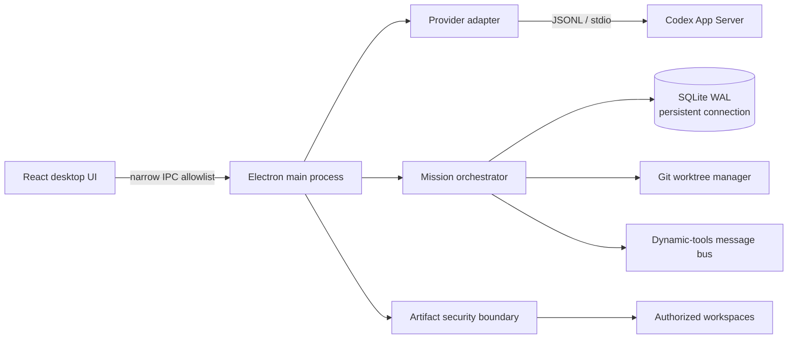
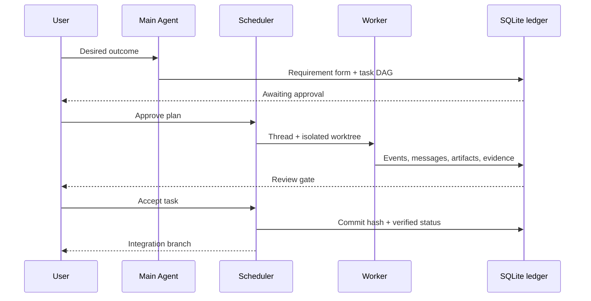

# Agent Deck production baseline

Last updated: 2026-09-07

## Product contract

Agent Deck is a local-first macOS desktop control room for running multiple independent coding-agent conversations in parallel. A conversation may optionally become a Mission: one planner creates a requirement form and dependency graph, then isolated workers execute tasks in Git worktrees with a durable message bus and human review gates.

Operational values must come from Codex App Server events, Git, or the local SQLite ledger. Unsupported capabilities are shown as unavailable; the browser build never fabricates runtime state.

## Runtime architecture

## Implemented production baseline

| Area | Current behavior | Truth source |
| --- | --- | --- |
| Parallel sessions | List, select, focus, steer, interrupt, archive, and lazy-load full conversation history | Codex App Server `thread/*` and `turn/*` |
| Mission planning | Structured requirement form and validated acyclic task graph | Codex output schema + SQLite |
| Worker execution | Dependency-aware dispatch with bounded parallelism; API Harness writes and Bash commands require a one-time visible approval | Scheduler + provider lifecycle events + approval ledger |
| API Harness | OpenAI-compatible providers run real local sessions, workspace reads, structured output, token usage collection, and approval-gated workspace writes/Bash | API response + local execution evidence + SQLite |
| Isolation | Per-task branches and Git worktrees | Local Git |
| Coordination | Durable worker-to-worker and worker-to-main messages through dynamic tools | Codex tool calls + SQLite |
| Review | Human acceptance gate, evidence, commit hash, integration branch | Git + user action |
| Recovery | Reattach/replay persisted in-flight turns after restart | Codex thread history + SQLite |
| Cancellation | Interrupt active turns while preserving files, worktrees, and evidence | Codex interrupt + SQLite |
| Artifacts | Click to open, reveal in Finder, export a file or artifact bundle | Authorized worktree/workspace paths |
| Reporting | Export a Markdown Mission report with tasks, evidence, artifacts, and recent bus traffic | SQLite ledger |
| Activity | Raw provider-event ledger with paginated older events | SQLite sequence cursor |
| Performance | Lightweight Mission summaries, on-demand detail, coalesced UI invalidation, lazy UI chunk, persistent SQLite connection | Local runtime |
| Security | Context-isolated/sandboxed renderer, narrow preload API, realpath containment checks, symlink escape prevention | Electron main process |

## P0 provider-execution contract

Every Mission calls a common provider runtime contract: `createThread`, `sendTurn`, `steer`, `interrupt`, `resumeThread`, and `readThread`. The Provider Adapter Host is the only place that maps a provider to that contract; the scheduler, message bus, review gates, and renderer never branch on a vendor wire protocol.

| Provider | Current stage | Safe capability |
| --- | --- | --- |
| Codex | Mission ready | Native thread lifecycle, approvals, worktrees, dynamic tools, realtime voice |
| DeepSeek / OpenAI-compatible | Mission ready | Real API sessions and usage; local reads; one-time-approved file write or Bash in an isolated Worker worktree |
| Claude Code | Bridge only | MCP bridge for progress/artifacts; it is not selectable for Mission dispatch until its JSON-stream lifecycle and permission adapter pass conformance tests |
| TraeCode | Bridge only | MCP bridge and ACP discovery; it is not selectable for Mission dispatch until its ACP client lifecycle and permission adapter pass conformance tests |

API Main Agents are deliberately planning-only. They cannot execute writes or commands. An API Worker can propose an operation, which pauses with its exact command or path in the Inspector; `Allow once` is the only route to execution. The approval decision, execution result, and worker turn are appended to the same local event ledger used for review and recovery.

## Performance acceptance baseline

- Mission list payload contains summaries and counts only; task/event/artifact bodies are not included.
- The selected Mission loads at most 100 recent events initially; older events use cursor pagination.
- Repeated provider notifications are coalesced before renderer refresh.
- Mission UI and graph dependencies are lazy-loaded so the session surface does not pay their startup cost.
- A 140-event SQLite write + summary/detail paging test completes in tens of milliseconds in the Electron runtime on the current development Mac; Git worktree creation is measured separately.

## Artifact security rules

1. A renderer can request only a file already published in that artifact's ledger entry.
2. The resolved real path must remain inside the task worktree, Mission integration worktree, or selected workspace.
3. Symlink targets are resolved before containment is checked.
4. Exporting an artifact bundle creates a new uniquely named directory and does not silently overwrite an existing bundle.
5. Missing or moved files surface a visible error instead of a fake success state.

## Release gates outside the codebase

The current arm64 build is suitable for controlled internal testing. Public distribution still requires infrastructure or credentials that are not present in this workspace:

- Apple Developer ID signing and notarization.
- A signed update feed with rollback policy.
- Crash reporting and privacy policy/consent decisions.
- CI builds for both Apple Silicon and Intel, plus upgrade tests against real user databases.
- A compatibility test matrix for each supported Codex CLI/App Server release.
- Separate Claude Code and other provider adapters; no provider should be advertised until its contract and lifecycle tests are real.

## Compatibility strategy

Codex App Server is versioned but evolving. The adapter must initialize capabilities, generate or pin protocol schemas per supported Codex version, normalize provider events into Agent Deck's internal thread/turn/item model, and fail closed when an unknown approval or mutation request appears. Provider-specific code stays behind the adapter boundary; Mission, artifact, SQLite, and UI layers depend only on normalized internal events.
