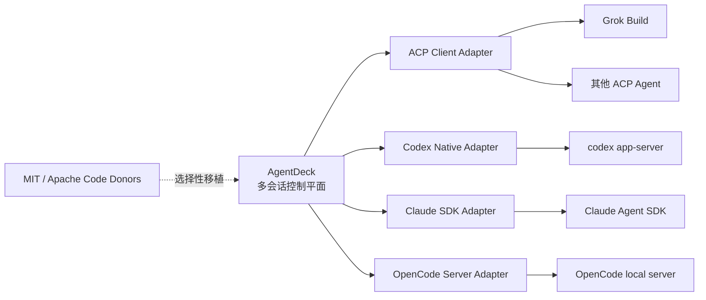

# AgentDeck 上游开源底座评估

> 状态：Draft v0.1  
> 日期：2026-09-06  
> 目标：判断 Codex、Claude Code、Grok Build/GrokBot、OpenCode 和 ACP 中哪些适合直接 Fork、作为运行时依赖、作为协议层或只做设计参考。

## 1. 结论

最省长期成本的方案不是 Fork 某一个 Coding Agent 做成“换皮客户端”，而是：

1. AgentDeck 保留自己的多会话控制平面、Attention Router、共享上下文池和 Worktree 管理。
2. 把官方 Agent Runtime 当作可替换 Sidecar：Codex App Server、Claude Agent SDK、Grok Build ACP、OpenCode Server。
3. 优先实现标准 ACP Adapter，再为能力更强但私有的协议实现 Native Adapter。
4. 从 MIT/Apache-2.0 项目选择性移植 UI、存储、安全和事件归约代码，保留 License、NOTICE 与修改说明。
5. 不 Fork Claude Code；其公开仓库许可证是 All rights reserved。

## 2. 许可证与复用方式

| 项目 | 许可证/开放状态 | 可以商用改造 | 推荐用法 | 结论 |
|---|---|---:|---|---|
| OpenAI Codex CLI/App Server | Apache-2.0 | 是，需保留许可与 NOTICE | 运行时依赖或 Native Adapter；必要时选择性移植 | 强烈推荐 |
| Anthropic Claude Code | 仓库公开，但 All rights reserved | 不能按普通开源项目 Fork | Claude Agent SDK 或结构化 CLI Adapter | 不 Fork |
| xAI Grok Build | Apache-2.0 | 是，需保留许可与第三方 Notice | ACP Agent、Headless Runtime、实现参考 | 推荐 |
| Franzferdinan51/GrokBot | MIT；Grok Build 部分 Apache-2.0 | 原则上可以 | UI/存储/安全代码 donor；不要整体继承 | 谨慎参考 |
| OpenCode | MIT | 是 | Local Server、SDK、Session/Event/UI 参考或可选 Runtime | 强参考 |
| Agent Client Protocol | Apache-2.0 | 是 | AgentDeck 的第一个标准化 Adapter 协议 | 推荐作为基础协议 |

许可证允许不代表商标可用。产品命名、Logo、登录方式、订阅额度复用和服务条款仍需分别核验。

## 3. 各底座的实际价值

### 3.1 Codex

官方确认 Codex CLI、SDK 和 App Server 均在 `openai/codex` 仓库中开源，主仓库使用 Apache-2.0；IDE 扩展和 Codex 云端不开放源码。

最值得直接复用：

- `codex-rs/app-server`：Thread、Turn、Item、审批、Steer、事件流。
- 当前版本 Schema 生成：降低 Adapter 跟随上游变化的成本。
- Sandbox、命令执行、补丁应用、配置解析和会话恢复实现。

不建议：

- Fork 整个 TUI 后把 AgentDeck 功能持续塞回去。
- 解析 Codex 私有状态文件代替 App Server。
- 复刻非开源 IDE 或云端界面。

### 3.2 Claude Code

`anthropics/claude-code` 是公开仓库，但 `LICENSE.md` 写明 © Anthropic PBC、All rights reserved，并受 Anthropic Commercial Terms 约束。因此“能看到 GitHub 仓库”不等于“可以 Fork 做商业产品”。

正确接入：

- Claude Agent SDK：Python/TypeScript、本地 Agent Loop、Session、Hooks、Permissions、Subagents、MCP。
- 或 `claude -p --input-format stream-json --output-format stream-json` 子进程。
- UI 和控制平面由 AgentDeck 实现，不复制 Claude Code 代码或品牌素材。

### 3.3 Grok Build

官方 Grok Build 是 Rust Agent Runtime + TUI，Apache-2.0，支持：

- 交互式 TUI。
- Headless/stdio 运行。
- Agent Client Protocol（ACP）。
- Workspace、VCS、Checkpoint、工具、Sandbox、MCP、Skills 和 Hooks。

它最适合成为 AgentDeck 的第一个 ACP 真机测试对象。我们不需要 Fork 它才能管理它；让 AgentDeck 作为 ACP Client 连接，更容易持续获取上游升级。

### 3.4 GrokBot Desktop

本次按名称假设用户指 `Franzferdinan51/GrokBot`。仓库实际包含：

- Electron + SolidJS 桌面包。
- Grok Build Headless `streaming-json` Adapter。
- Conversation Store、模型密钥、Telegram、Preview、文件/Git 浏览。
- 大量 OpenClaw 派生代码和第三方组件。

优点：

- 产品形态与本项目接近。
- Renderer 开启 `sandbox`、`contextIsolation`，关闭 `nodeIntegration`。
- 密钥使用 Electron `safeStorage`。
- Headless Runtime 的参数与结构化事件处理可以参考。

关键问题：

- 后端只有一个全局 `current: ChildProcess`，明确拒绝第二个并行任务。
- 任务队列是串行的，不是我们需要的同时运行多个 Session。
- 仓库约 524 MB、2.8 万工作区文件，混入多套上游实现，维护面过大。
- 当前仓库较新、社区验证有限；README 功能很多，但需要逐项验证。
- Root Lockfile 与部分 Workspace Manifest 不一致，无法直接 Frozen Install。
- Smoke Test 在 macOS 上把 `/var/...` 与 `/private/var/...` 判为不同路径而失败。

因此它是一个不错的 Code Donor 和竞品样本，但整体 Fork 之后仍需重写 Session Manager、事件路由、数据模型和主界面，未必比现有 AgentDeck Demo 便宜。

### 3.5 OpenCode

OpenCode 使用 MIT 许可证，已经具备 Client/Server 架构、桌面客户端、类型安全 SDK、Session API、SSE Event、Permission、Question、Diff、Fork 和 Abort。

它是比 GrokBot 更成熟的参考底座，尤其值得研究：

- Local Server 与 Desktop Sidecar 的进程边界。
- OpenAPI 生成的 TypeScript SDK。
- Session 列表、状态、子 Session、Diff、权限请求和 SSE 事件归约。
- 多 Provider 配置与模型选择体验。

但 OpenCode 主要是自己的 Agent Harness + 多模型 Provider，不等价于“管理原生 Codex/Claude Code 会话”。如果整体 Fork，仍需加入 Codex App Server 和 Claude Agent SDK Adapter，并处理快速上游 Rebase。

### 3.6 ACP

Agent Client Protocol 是 Apache-2.0 的开放协议，目标是让客户端/编辑器连接任意 Coding Agent。稳定 Wire Protocol 当前通过 `initialize.protocolVersion` 协商，功能通过 Capability 协商；Schema/SDK Artifact 版本与 Wire Version 分离。

这与 AgentDeck 的 Adapter 设计高度一致：

- `AcpAdapter` 作为标准通道。
- Codex/Claude Native Adapter 只承载 ACP 暂未覆盖的增强能力。
- Provider 已支持 ACP 时无需重复写专用 Parser。
- 上游变化优先被 Protocol Version 和 Capability Gate 吸收。

## 4. 本地验证状态

| 项目 | 状态 | 位置/地址 | 说明 |
|---|---|---|---|
| GrokBot upstream | 已浅克隆并静态审计 | `research/upstreams/grokbot` | 未执行主进程 |
| GrokBot isolated desktop | 已安装依赖、TypeScript 通过、Build 成功 | `research/labs/grokbot-desktop` | 与大 Workspace 隔离 |
| GrokBot smoke | 失败 | 同上 | macOS `/var` 与 `/private/var` 路径断言 |
| Safe Renderer Preview | 运行中 | `http://127.0.0.1:4174/` | Mock API；无文件/Shell/凭据能力 |
| Full Electron App | 未启动 | - | 高权限第三方代码，需要显式风险授权 |

## 5. 推荐的低成本实施路径

### Phase A：保留当前产品壳

- 继续使用现有多会话 Grid 作为产品交互基线。
- 借鉴 OpenCode 的 Server/SDK 边界和 GrokBot 的 Electron 安全实现。
- 不把任何单一上游仓库设为不可替换的 Product Core。

### Phase B：先实现两个 Runtime

1. `AcpAdapter`：用 Grok Build 做真机验证。
2. `CodexNativeAdapter`：App Server stdio，验证 2–4 个并行 Thread。

这两条能验证“标准协议覆盖率”和“供应商原生增强能力”的边界。

### Phase C：Claude 与 OpenCode

1. `ClaudeAgentSdkAdapter`：TypeScript Sidecar；先 BYOK。
2. `OpenCodeAdapter`：连接本地 OpenCode Server，复用 Session/Event API。

### Phase D：Selective Code Import

建立 `THIRD_PARTY_NOTICES.md` 和 Code Donor 清单。每次移植记录：

- 来源仓库、Commit SHA、原许可证。
- 原始文件路径和目标文件路径。
- 我们做出的修改。
- 是否包含商标、图标或供应商默认 URL。

## 6. 最终建议

如果目标是最快做出可卖的 MVP：

> **不要 Fork Claude Code；不要整体 Fork GrokBot；使用 ACP + Codex App Server 建执行底座，选择性借鉴 OpenCode/GrokBot。**

整体 Fork 的短期优势是 UI 和很多功能“看起来已经有了”，但我们的核心差异恰好是它们最弱的部分：多活动 Session、跨 Session Attention、共享上下文和统一 Provider 调度。继承一个单会话产品会很快遇到架构重写，反而延长商业验证时间。

## 7. 参考资料

- [OpenAI Codex 开源组件](https://learn.chatgpt.com/docs/open-source)
- [OpenAI Codex Repository](https://github.com/openai/codex)
- [Anthropic Claude Code License](https://github.com/anthropics/claude-code/blob/main/LICENSE.md)
- [Claude Agent SDK](https://code.claude.com/docs/en/agent-sdk/overview)
- [xAI Grok Build](https://github.com/xai-org/grok-build)
- [GrokBot Desktop](https://github.com/Franzferdinan51/GrokBot)
- [OpenCode](https://github.com/anomalyco/opencode)
- [OpenCode SDK](https://opencode.ai/docs/sdk/)
- [Agent Client Protocol](https://github.com/agentclientprotocol/agent-client-protocol)
