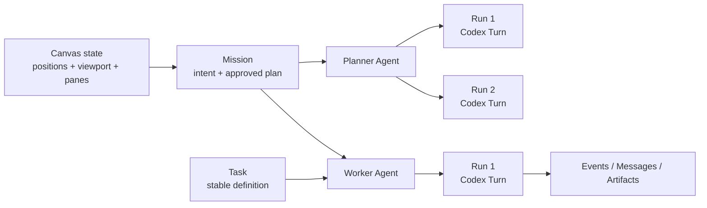

# Agent Deck V0.3.2 — Interactive Mission DAG and report-quality closeout

V0.3 turns the Mission graph from a read-only visualization into a durable desktop orchestration surface. V0.3.1 hardened provider-event convergence, responsive graph interaction, and macOS accessibility. V0.3.2 adds an editorial, data-visualization-aware HTML report contract and a real publication quality gate. It continues to use real Codex Threads, local Git Worktrees, SQLite state, and user review gates; no orchestration state is mocked.

## Runtime model

- **Mission** owns the goal, approved task DAG, lifecycle, and integration state.
- **Task** is a stable unit of work. Its ID is preserved when a pre-dispatch plan is edited.
- **Agent** is a stable planner or worker identity attached to the Mission and optional Task.
- **Run** is one real Codex Turn. Re-prompts and retries create additional Runs instead of overwriting history.
- **UI state** is persisted per Mission in SQLite, independently of operational state.

## Shipped scope

| Area | V0.3 behavior |
|---|---|
| Canvas | Drag nodes, persist positions, persist viewport, zoom, pan, fit view, mini-map |
| Layout | Left-to-right, top-to-bottom, and compact deterministic auto-layout |
| Navigation | Multi-select, upstream/downstream path highlighting, semantic edge filters |
| Nodes | Agent avatar, live state, phase, Run count, artifact count, conversation shortcut |
| Plan editing | Add/remove/edit tasks, edit dependencies, connect nodes, double-click an edge to remove it |
| Safety | Editing is gated to `ready` Missions before any Worker Thread or Worktree exists |
| DAG validation | Duplicate/missing/self dependencies and cycles are rejected before persistence |
| Change impact | Added, removed, and changed task counts are shown before applying |
| History | Every real planner/worker Codex Turn is persisted as a Run and exposed in the Inspector |
| Layout resilience | Mission sidebar and Inspector widths are user-resizable and persisted |
| Compact-window graph | Neutral edge labels collapse below 1280px and return through a 28px pointer target, selection, or path focus |
| Accessibility | React Flow animation, fit-view motion, and application transitions follow macOS Reduce Motion |
| Event convergence | Duplicate and out-of-order Codex provider events are idempotent; late planner and worker results repair transient state instead of duplicating evidence |
| HTML report compiler | Evidence workers keep raw data reusable while synthesis workers receive editorial writing, chart-selection, responsive, print, and accessibility requirements |
| Report quality gate | Verified reports must score at least 78 and data-rich reports require at least two evidence-backed figure surfaces; scores and diagnostics persist with artifacts |
| Migration | Existing SQLite databases receive additive `mission_runs` and `mission_ui_state` tables |
| Ledger migration | Existing databases receive additive event/artifact dedupe keys and partial unique indexes without deleting history |

## Deliberate boundaries

- A running Mission cannot have its task graph destructively rewritten in V0.3. Runtime graph mutation needs a separate pause/reconcile protocol.
- The local macOS package is unsigned. Distribution outside the development machine still requires Developer ID signing and notarization.
- Automatic conflict resolution remains a real Worker workflow; V0.3 does not hide Git conflicts with synthetic success states.

## Verification

- 22 Mission core tests cover persistence, safe plan updates, Run history, graph layout/path/validation, real Worktree handling, recovery, intervention, cancellation, duplicate events, and out-of-order results.
- 3 conversation/performance tests protect bounded projection and large structured-output handling.
- 4 Sites packaging tests and 2 realtime voice lifecycle tests pass.
- Desktop QA covers 1540×960 and 1120×720, graph control visibility, real drag persistence through the Electron bridge, plan editor visibility, HTML preview safety, pane containment, focused Inspector reading, edge-label hit targets, and Reduce Motion.
